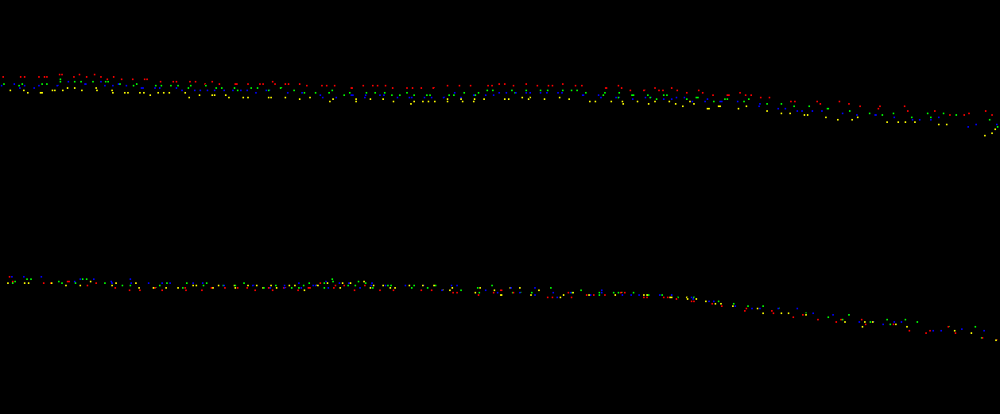
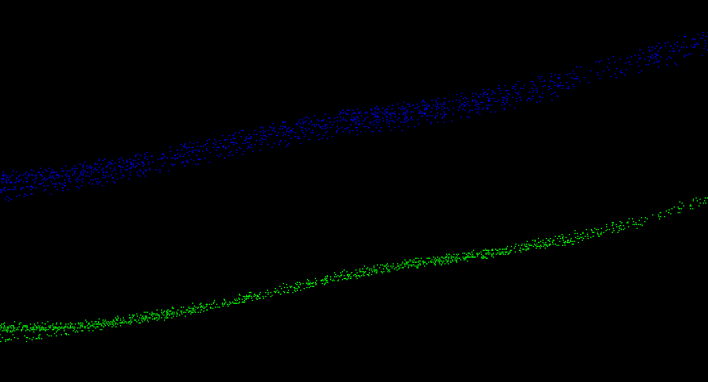
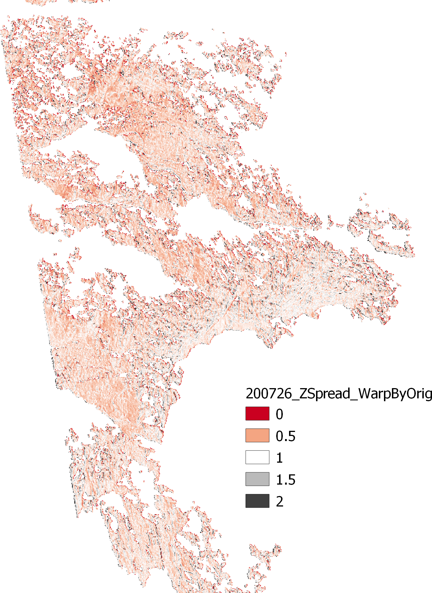

# Helheim Inclination 
Some hacks to apply scanner inclination data to ATLAS North and South.

## Notes
1. Roll and pitch rotations, which are generated from noise-filtered scanner roll and pitch inclination values, are applied to scan points in the SOCS system. The inclination values nearest in time to each point are used; thus, the adjustment is non-rigid. The rotation definitions are found in any Riegl TLS User Manual.

2. In order of typical magnitude, the inclination values contain:
    - Static scanner inclination (think of this as the DC component of the roll and pitch signals, or the single roll and pitch values that would exist if the scanner inclination did not change during the course of the scan),
    - A cyclical (period = 360°) systematic inclination sensor error.
    - Temporal inclination changes the TLS is experiencing both between scans and within each scan.

    Unfortunately, we don't know if the cyclical systematic error component changes over time. Qualitatively, the phase appears stable but the mean bias (DC component) and amplitude do show some temporal change (~ +/-20%) between data.

3. In light of the items listed in Note #2 above, applying the inclination values does the following (order matches the bullet ordering in Note #2):
    - Invalidates the SOP matrix required to transform the point data from the SOCS to the PRCS system.
    - Imparts a vertical "wave" in the data from the cylical inclination sensor error.
    - Reduces relative vertical differences between the point clouds by ~50%.

    Although bullets 1 & 2 above are are not at all desirable, the improvement in relative alignment is attractive for analysis of _relative_ glacier motion. 

4. With regard to _absolute_ location, we are still pushing the inclination-adjusted point cloud data to UTM Zone 24 via SOP --> POP --> UTM Projection. 
    - We are mitigating the SOP invalidation problem by subtracting the mean roll and pitch inclination values contained in the scans used for the MSA registration (which is the basis of the SOP matrix for each year) from each scan. This prevents us from applying the inclination information twice (inclination is contained in the SOP, along with Earth curvature).
    - Examination of ATLAS North and South point data on common surfaces indicate the above mitigation method is effective (reduces vertical differences from tens of meters to sub-meter), at least for being able report relative motion results in a georeferenced frame.
    - The "wave" is still present in the data, and could probably be visualized by differencing a DSM from an unadjusted point cloud to it corresponding adjusted (for inclination) point cloud. Any temporal changes (if they exist) in the cyclical systematic inclination error are also still present in the data.

5. You can download sample data from [here](https://uofh-my.sharepoint.com/:f:/g/personal/pjhartze_cougarnet_uh_edu/En7uPV7ur-1GrKyoPuz479YBZl0B2Fs6f8Lm1URzX-fHSw?e=l4ujnh). 
    - Only the 2018 directories contain both ATLAS North and South data.
    - Only the 2018 directories contain data pushed to UTM. The data in the other directories are in SOCS.

## Use
You will need a directory containing the MTA'd RXP files.

1. Build and install Pete's [rivlib-utils](https://github.com/gadomski/rivlib-utils) on your machine. Change the `false` argument to `true` on line #10 in the source file `inclination.cpp` before building. This changes the timestamps from internal time to GPS time.
2. Copy the `rxp2incl.sh` script to your MTA directory and run to extract inclination data from the RXP files. Text files containing time, roll, and pitch (units are GPS time seconds and degrees) will be saved into the RXP directory with "-incl" appended to the source RXP filenames.
2. Copy the `rxp2laz.sh` script to your MTA directory and run to extract and save point cloud data from the MTA RXP files. You will need PDAL with the RXP reader plugin.
3. Edit the user input at the top of the `main.py` script and run to apply the inclination data to the point cloud data. New point cloud LAZ files will be create with appropriate filenames. You can choose to do one or more of the following:
    - Not apply any inclination data (just transform the data from SOCS to UTM).
    - Warp the data and transform to UTM using the invalidated SOP.
    - Warp the data and transform to UTM using the SOP mitigation method detailed in Note #4 above.

# Sample Results

## Profiles
- All results shown below are for ATLAS South.
- The profiles are cut across small sections of what appears to be exposed rock that are collected from the middle to the end of the scan.
- The top profiles are always the original data; the bottom profiles are always the adjusted(warped) data.

_200501 - All 4 Times - Middle of Scan_

_200501 - All 4 Times - End of Scan_

_200501, 200508, 200513, 200515 - All 4 Times - End of Scan_

## Vertical Data Spread
- Near field rocks at ATLAS south
- July 26, 2020, all 4 times
- 2 meter cells showing (WarpedMax - WarpedMin) / (OriginalMax - OriginalMin)
- Values less than one (reddish colors) indicate improvement from applying the inclination data.

