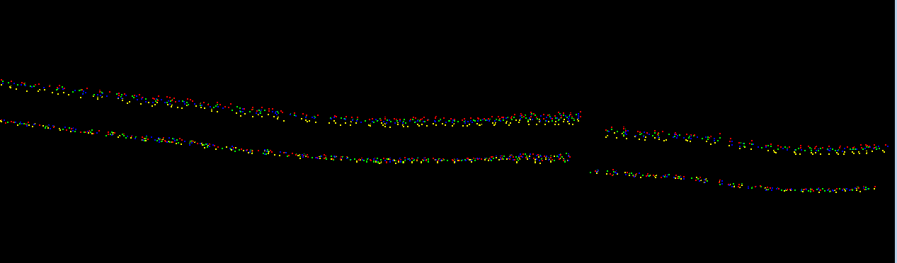
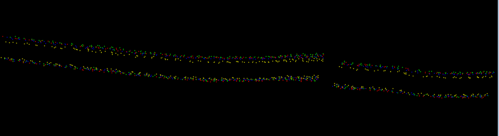
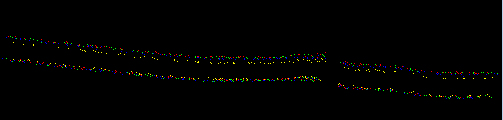
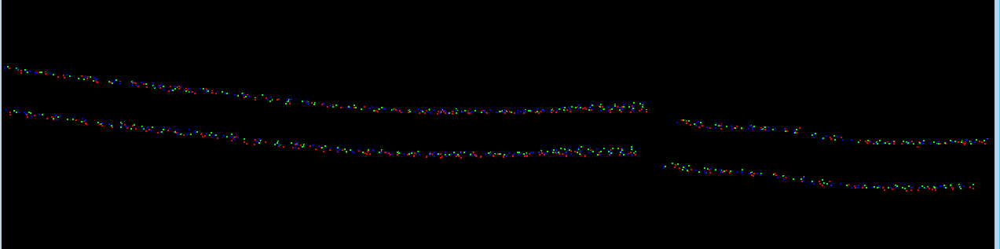
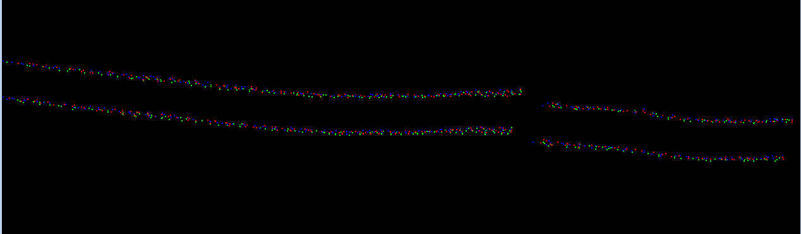
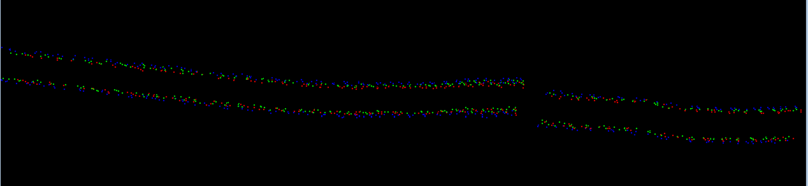
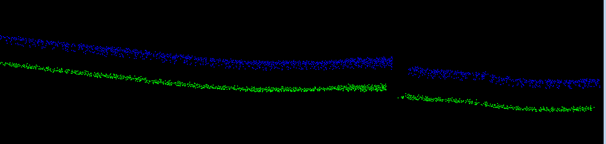

# Helheim Inclination Correction
Some scripts to apply inclination values to the Helheim TLS data. 

## Use
You will need a directory of MTA'd RXP files and a directory of corresponding final, filtered LAZ files.

1. Build and install Pete's [rivlib-utils](https://github.com/gadomski/rivlib-utils) on your machine. You will need to change the `false` argument to `true` on line #10 in the source file `inclination.cpp`. This changes the timestamps from internal time to GPS time.
2. Run the `rxp2incl.sh` script to extract inclination data from the MTA'd RXP files for the data you want to correct. You will need to edit the location of the RXP directory in the script. Text files containing time, roll, and pitch (units are internal time seconds and degrees) will be saved into the RXP directory with "-incl" appended to the source RXP filenames.
3. Run the `main.py` script to apply the inclination data to the point cloud data. You will need to edit the directory paths for the LAZ and inclination data. LAZ files of the point cloud data in the SOCS frame and corrected (for inclination) SOCS frame will be saved into the LAZ directory with "-socs" and "-socs-incl_applied" appended to the source LAZ filenames.

## Sample Results
- All results shown are for ATLAS South.
- The profiles are cut across a small section of what appears to be exposed rock to the left of the scanner, about 1300 meters from the scanner. 
- The top profiles are always the uncorrected data; the bottom profiles are always the data corrected for inclination.
- The correction appears to tighten intra-day scans.
- Scans from the same time from multiple days appear to agree quite well with and without correction.
- The vertical spread is reduced by about half when looking at scan from all times from the 3 days inspected here (200501, 200508, 200513).

### Day 200501
Vertical span of uncorrected data is around 0.6-0.7 meters.

### Day 200508
Vertical span of uncorrected data is around 0.6-0.7 meters.

### Day 200513
Vertical span of uncorrected data is around 0.6-0.7 meters.

### All three days: Early morning (0100)

### All three days: Mid-day (1300)

### All three days: Later afternoon (1900)

### All three days: All times
Uncorrected profiles (top; blue) span about 0.8 meters vertically. The corrected profiles (bottom; green) span about 0.4 meters vertically.
