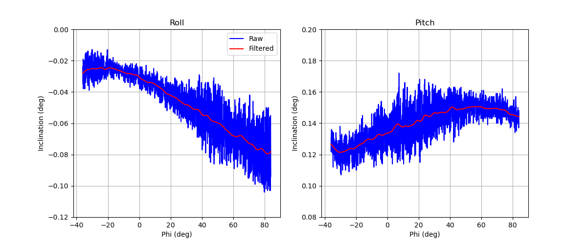
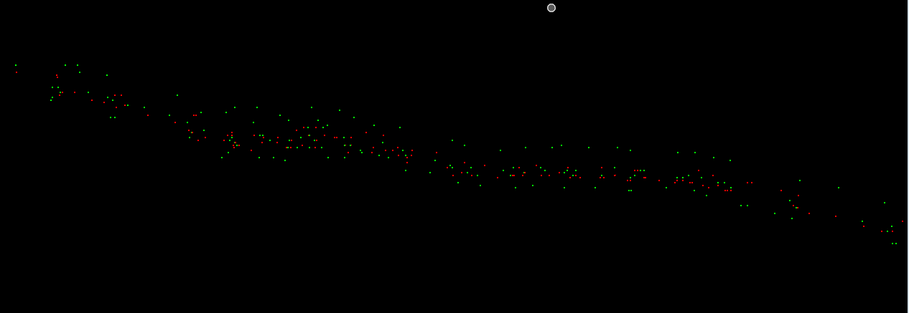
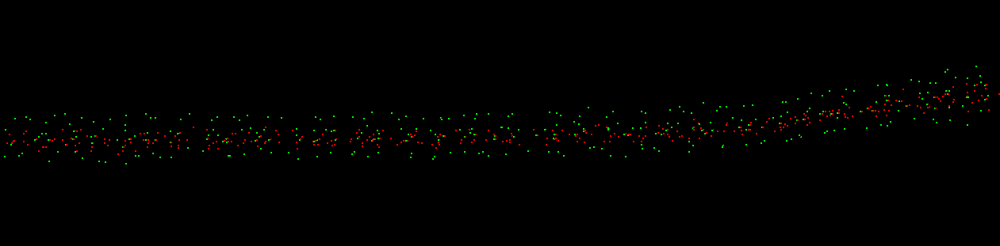

# Helheim Inclination 
A script to apply scanner inclination data to ATLAS North and South point clouds. Vertical repeatability improvement is in the 50% range, with extreme examples showing up to 90% improvement.

## 1. Problem
Point clouds from the same scanner do not vertically align on stationary (exposed rock) surfaces. The alignment differences are greater at longer ranges, suggesting non-stationary scanner orientation.

## 2. Mitigation Approach
The general concept is to apply the roll and pitch angles that are supplied by the scanner inclination sensors to each point cloud. We have experimented with rigid point cloud rotations, based on single mean roll and pitch values, and non-rigid point cloud transformations, where each point is rotated according to the closest roll and pitch values in time. The roll and pitch signals are low-passed prior to the non-rigid transformations to mitigate injecting noise into the point cloud. Qualitatively, the non-rigid transformations were found to work best, and are therefore the focus of the following discussion. Two examples of raw and low-passed roll and pitch signals from ATLAS South scans are shown below.

_180804_010156 - Filtered Roll and Pitch (0100 local time)_

_180804_190154 - Filtered Roll and Pitch (1900 local time)_

In order of typical magnitude, these roll and pitch inclination signals consist of the following:

- Static scanner inclination (the single roll and pitch values that would exist if the scanner inclination did not change during the course of the scan),
- A cyclical (period = 360°) systematic inclination sensor error.
- Temporal inclination changes the scanner is experiencing within a scan.

Given the presence of cyclical sensor error, applying a non-rigid transformation introduces a vertical "wave" into the point cloud. Furthermore, inclination must be applied to point clouds in the SOCS system. Doing so, however, invalidates the SOP matrix, since the SOP matrix itself is based on a scan with similar inclination values. Thus, applying the SOP matrix after applying the inclination data results in a (roughly) double application of the inclination data.

We address the problems of "wave" introduction and "double" inclination application by removing the modeled cyclical component of the scan used to solve the SOP matrix, which is the scan used in the MSA registration. This produces much better alignment in the final UTM coordinate system between overlapping North and South scan data on stationary (exposed rock) surfaces. Note that the cyclical component is modeled with a sine wave having a period of phi=360°, where phi is the horizontal scan angle. An example of the cyclical model (applied to the MSA scan corresponding to the filtered signals shown above) and this model subsequently removed from the above roll and pitch signals are shown below.

_180731_010159 - MSA Scan Modeled Roll and Pitch_

_180804_010156 - Model Removed, Filtered Roll and Pitch (Scan is at same time of day as MSA scan)_

_180804_190154 - Model Removed, Filtered Roll and Pitch (Scan is at different time of day as MSA scan)_

Notes:
- The cyclical model fit is degraded by any intra-scan motion present in the SOP MSA scans. It appears that the early morning (0100 local time) scans tend to be well-behaved with respect to the cyclical model. Thus, these 0100 local time scans should, perhaps, be preferred for future MSA adjustments, as they may suffer less intra-scan motion than late day scans.
- The low-pass filter size is based on prior work with the Arapahoe Basin TLS data. Qualitative inspection suggests it may be over-smoothing the signal, thus reducing the effectiveness of the warp correction at small scales. For now, the filter is believed to be conservative, and we prefer to err on the side of not injecting noise into the point cloud.
- Qualitatively, the results are best in the middle of the scan. There does not appear to be as much improvement in the first and last 10-15 degrees (horizontal angle).

## 3. Use
You will need a directory containing MTA'd RXP files.

1. Build and install Pete's [rivlib-utils](https://github.com/gadomski/rivlib-utils) on your machine. Change the `false` argument to `true` on line #10 in the source file `inclination.cpp` before building. This changes the timestamps from internal time to GPS time.
2. Copy the `rxp2incl.sh` script to your MTA directory and run to extract inclination data from the RXP files. Text files containing time, roll, and pitch (units are GPS time seconds and degrees) will be saved into the RXP directory with "-incl" appended to the source RXP filenames.
3. Copy the `rxp2laz.sh` script to your MTA directory and run to extract and save point cloud data from the MTA RXP files. You will need PDAL with the RXP reader plugin.
4. Edit the user input at the top of the `main.py` script and run to apply the inclination files created in step #2 above to the LAZ files created in step #3 above. Prior to application of the inclination data, the trend of the SOP MSA scan inclination is first removed. New point cloud LAZ files will be created with the coordinates in UTM.

## 4. Typical Sample Profiles

- ATLAS South data, transformed and projected to UTM zone 24N
- Green = No adjustment; Red = MSA model removed, warped
- Note that the proposed method does not eliminate the vertical discrepancy; it is only able to remove a large portion of it.

_180804 - Exposed Rock - All 4 Scans_

## 5. To-Do

Thus far, the approach has been evaluated from the perspective how well it works. We need to develop systematic post-adjustment analyses to quantify the effectiveness and to identify when and where it performs poorly.