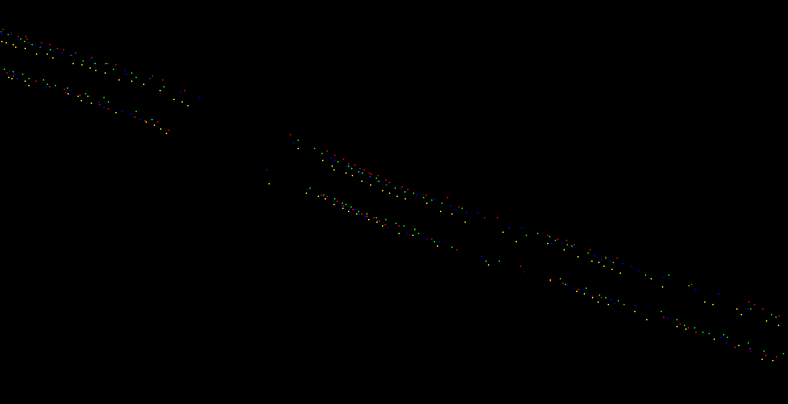
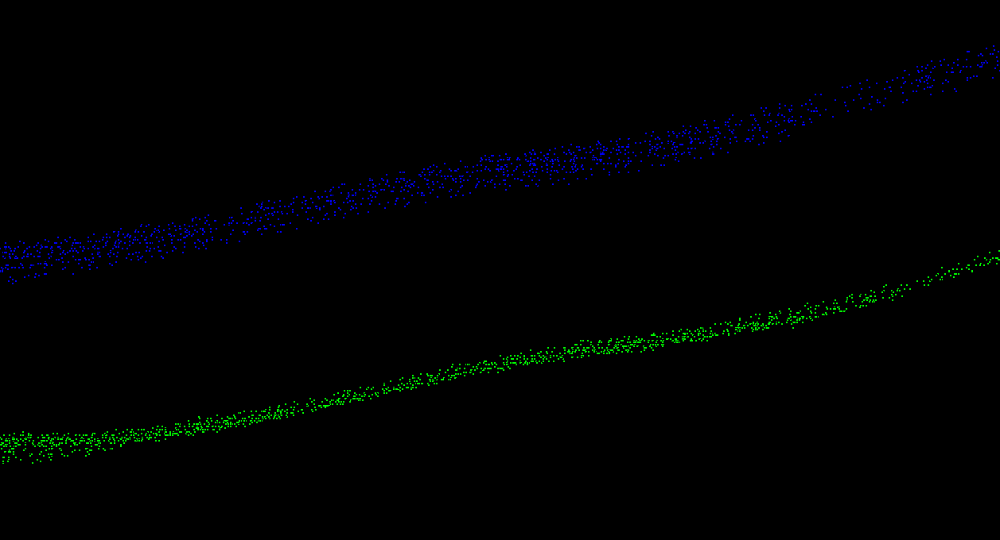

# Helheim Inclination 
Some scripts to apply noise filtered inclination values to the Helheim TLS data in a few ways.

## Notes
- Rotations, which are generated from the inclination values, are applied to the point clouds in the SOCS system.
- The inclination values are dominated by systematic inclination sensor error, but also contain the actual temporal orientation changes the TLS is experiencing.
- Therefore, applying the inclination values does two things:
    1. It tilts the point cloud by several meters, most of which is due to sensor systematic error. This invalidates the SOP matrix.
    2. It reduces relative vertical differences between the point clouds by 50% or more.
- Thus, at present, the results may be useful for analysis of _relative_ glacier motion, but should not be relied upon for spatial analyses where _absolute_ location is important.
- A few transformations based on the inclination data were tested:
    1. Warp: The inclination values are applied temporally to the point cloud data. This results in a non-rigid transformation of the point cloud. This method produces the best relative alignment between point clouds.
    2. Rotate: The mean inclination value is applied to the entire point cloud. This is a rigid transformation, but does not improve the relative alignment of the point clouds as much.
- It may be possible to apply a common "de-warp" to the warped point clouds in order to apply the SOP matrix, at least in an approximate sense. A new registration would need to be solved for the most reliable georeferenced data. If de-warping is attempted, the night scans may be the best reference, given the absence of sunlight-induced thermal motion (assuming this is actually the cause of the temporal motion).
- It appears that the systematic error in the inclination is not stable. Note the decreasing performance as data from multiple days begin to be compared.

## Use
You will need a directory containing the MTA'd RXP files.

1. Build and install Pete's [rivlib-utils](https://github.com/gadomski/rivlib-utils) on your machine. Change the `false` argument to `true` on line #10 in the source file `inclination.cpp` before building. This changes the timestamps from internal time to GPS time.
2. Run the `rxp2incl.sh` script to extract inclination data from the MTA'd RXP files (using Pete's tool you installed in Step 1) for the data you want to correct. You will need to edit the location of the RXP directory in the script. Text files containing time, roll, and pitch (units are GPS time seconds and degrees) will be saved into the RXP directory with "-incl" appended to the source RXP filenames.
2. Run the `rxp2laz.sh` script to convert the MTA RXP files to LAZ files. You will need PDAL with the RXP reader plugin.
3. Run the `main.py` script to apply the inclination data to the point cloud data. You will need to edit the data directory path and choose whether to warp or rotate the LAZ data. LAZ files will be saved to the data directory with a "-warped" or "-rotated-mean" tag appended to the source LAZ filename.

## Sample Result Profiles
- All results shown are for ATLAS South.
- The profiles are cut across small sections of what appears to be exposed rock that are collected from the middle to the end of the scan.
- The top profiles are always the original data; the bottom profiles are always the transformed data.
- The warped data tends to agree better than the rigidly rotated data.
- Might be nice to generate some DEM differences on the entire exposed rock area for better visualization.

_**200501 - All 4 Times - Middle of Scan: Warped**_

_**200501 - All 4 Times - Middle of Scan: Rotated**_

_**200501 - All 4 Times - End of Scan: Warped**_

_**200501 - All 4 Times - End of Scan: Rotated**_

_**200501, 200508, 200513, 200515 - All 4 Times - End of Scan: Warped**_

_**200501, 200508, 200513, 200515 - All 4 Times - End of Scan: Rotated**_

